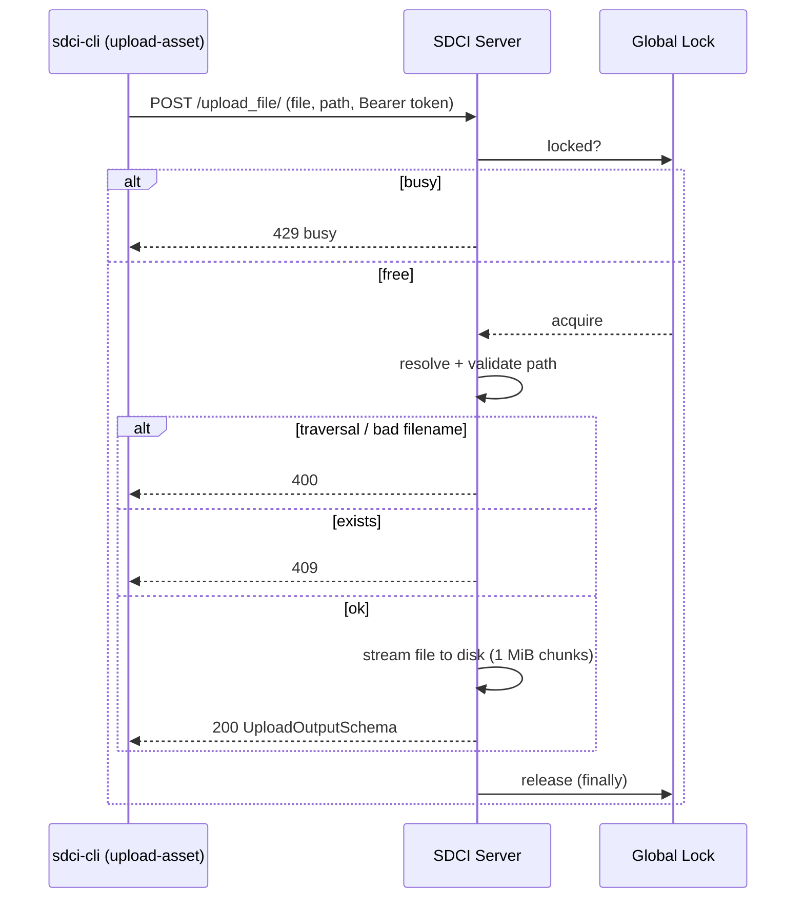

# File Upload

SDCI can push a single file (asset) to the server before or instead of running a
task. The file is stored under the server's upload directory, inside a
caller-specified relative directory (created recursively), keeping its original
filename.

## Server configuration

The upload directory is set with `--upload-dir` (or the `UPLOAD_DIR` env var,
default `./uploads`). It is created at startup if missing.

```bash
sdci-server --upload-dir ./uploads --server-token YOUR_TOKEN --tasks-dir ./tasks
```

## Endpoint

`POST /upload_file/` — `multipart/form-data`, Bearer token required.

| Field  | Type         | Meaning                                        |
|--------|--------------|------------------------------------------------|
| `file` | `UploadFile` | The file payload.                              |
| `path` | form `str`   | Relative destination directory (`REMOTE_PATH`).|

Response (`200`):

```json
{ "path": "releases/v1/app.zip", "size": 1234, "status": "UPLOADED" }
```

| Status | Meaning                                  |
|--------|------------------------------------------|
| 200    | Upload succeeded                         |
| 400    | Path traversal / invalid destination     |
| 401    | Bad/missing token                        |
| 409    | Destination file already exists          |
| 429    | Server busy (a task or upload is running)|

The endpoint shares the global lock with task execution, so the server runs
**either one task OR one upload at a time** and never overwrites an existing file.

## Client

```bash
sdci-cli upload-asset [--token TOKEN] SERVER LOCAL_FILE REMOTE_PATH
```

Example (lands at `<upload-dir>/releases/v1/app.zip` on the server):

```bash
sdci-cli upload-asset --token HAPPY123 http://localhost:8842 ./app.zip releases/v1
```

The client validates that `LOCAL_FILE` exists, streams it with a progress bar, and
exits non-zero on any failure. Token resolution is identical to `run`:
`--token` → `SDCI_TOKEN` env var → keyring.

## Flow


