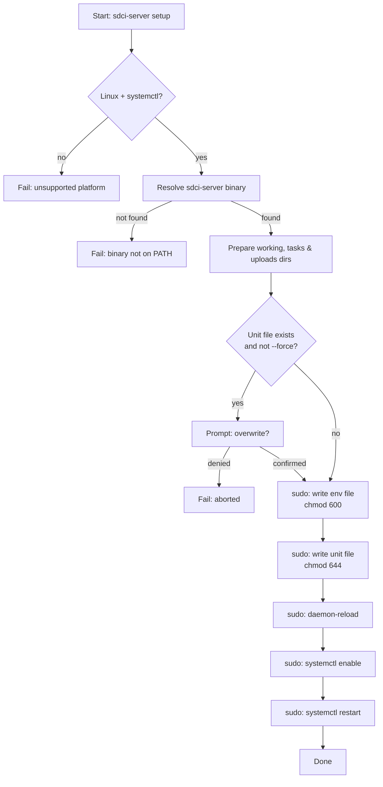

# systemd Setup

`sdci-server setup` installs SDCI as a persistent systemd service on Linux.

It performs the following steps (all privileged steps use `sudo`):

1. Checks the platform (Linux + `systemctl` available).
2. Resolves the `sdci-server` binary path from `PATH`.
3. Creates the working directory (`~<user>/.sdci`), the tasks directory, and the uploads directory.
4. If the unit file already exists and `--force` is not set, prompts for confirmation.
5. Writes `/etc/sdci/sdci.env` (mode `0600`, root-readable only) containing the token.
6. Writes `/etc/systemd/system/<name>.service` (mode `0644`).
7. Runs `daemon-reload`, `enable`, and `restart`.

## Usage

```bash
sdci-server setup --ip <HOST> --token <TOKEN> [OPTIONS]
```

| Flag | Required | Default | Description |
|---|---|---|---|
| `--ip` | yes | — | Host/IP the server binds to |
| `--token` | yes | — | Server authentication token |
| `--port` | no | `8842` | Port to listen on |
| `--tasks-dir` | no | `~/.sdci/tasks` | Directory containing task `.sh` scripts (if provided, must already exist) |
| `--uploads-dir` | no | `~/.sdci/uploads` | Directory where uploaded files are stored (if provided, must already exist) |
| `--user` / `--run_as_user` | no | invoking user | OS user the service runs as (both names are accepted; when omitted, the invoking user is kept) |
| `--service-name` | no | `sdci` | systemd unit name |
| `--force` | no | false | Overwrite existing unit without prompting |

## Generated Unit File

```ini
[Unit]
Description=SDCI - Sidecar Micro CD server
After=network-online.target
Wants=network-online.target

[Service]
Type=simple
User=<user>
WorkingDirectory=/home/<user>/.sdci
EnvironmentFile=/etc/sdci/sdci.env
ExecStart=/usr/local/bin/sdci-server serve --host <ip> --port <port> --tasks-dir <tasks_dir> --uploads-dir <uploads_dir>
Restart=on-failure
RestartSec=5

[Install]
WantedBy=multi-user.target
```

The token lives **only** in `/etc/sdci/sdci.env` (mode `0600`) and is never visible in the unit file or `systemctl cat` output.

## Install Sequence



## Requirements

- Linux with systemd (`systemctl` must be on `PATH`).
- `sdci-server` must be installed in the active environment.
- `sudo` access is required for writing to `/etc/systemd/system/` and `/etc/sdci/`.
